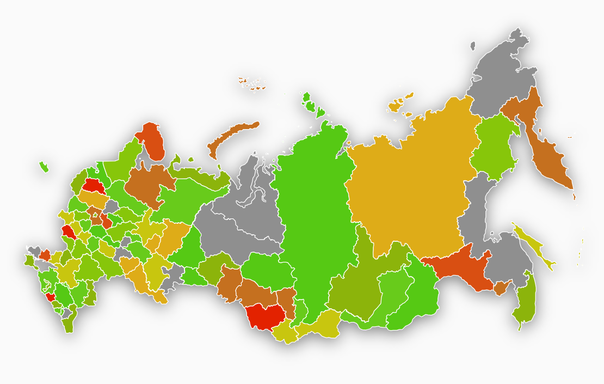
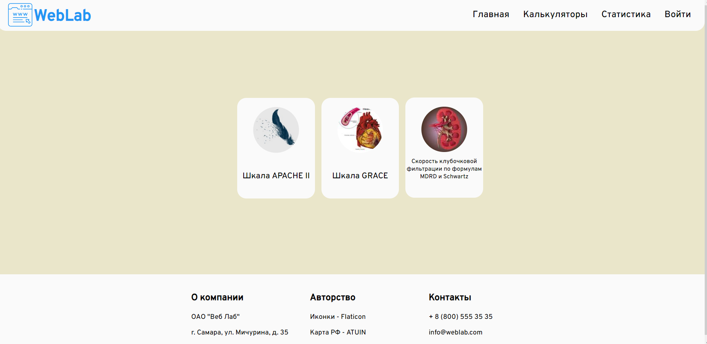

# Medical-Calculator

Изначально основной целью проекта были медицинские калькуляторы, но сейчас там есть некоторые дополнительные функции.

# Утилити

**Раздел "Статистика".**

При регистрации пользователь указывает свой регион проживания. В разделе "Статистика" пользователь может оставить оценку своего самочувствия по десятибалльной шкале (от 1 до 10, ноль ввести нельзя).

После того как пользователь нажмёт кнопку проголосовать, в базу данных попадает его голос, далее у региона, который соответствует региону проголосовавшего пользователя, обновляется среднее значение оценки пользователей. Если такой записи нет, она добавляется. То есть записей в этой таблице будет столько, сколько и существует регионов в РФ, и каждому региону соответствует свое среднее значение баллов, которые отправили пользователи данного региона.

На самой странице, каждому региону присваивается среднее значение из бд, и в соответствии с ним, он окрашивается в определенный цвет. 1 - красный, 10 - зеленый. 

Например, регион со средним значением 5,5 будет иметь жёлтый цвет, то есть в этом регионе в среднем люди оценивают свое самочувствие на "удовлетворительно".

**Раздел "Калькуляторы".** 

Используется 3 медицинских калькулятора: Шкала Apache II, Шкала Grace, Скорость клубочковой фильтрации по формулам MDRD и Schwartz. Формулу отдельно взятого калькулятора вы можете посмотреть на его странице.

# Структура базы данных

**Таблица "regions"**. Содержит список всех регионов РФ. 

**Таблица "roles".** Содержит список ролей.

**Таблица "users".** Содержит список всех зарегистрированных пользователей и их данные.

**Таблица "user_roles".** Зависимости пользователей к ролям. Пока у всех роль "ROLE_USER".

**Таблица "votes".** Содержит голосов пользователей из раздела "Статистика". Голосов может быть столько, сколько зарегистрировано пользователей, меньше быть может, больше не может. Таблица содержит id пользователя, id его региона и непосредственно то количество баллов, которое он ввёл.

**Таблица "votes_avg".** Список регионов с соответствующим им средним значением баллов.
# Требования приложения:
  1. JDK: 17
  2. Apache Maven: 3.8.6
  3. PostgreSQL: 15.3
  4. Для корректной работы приложения экспортируйте уже существующую базу данных, файл для экспорта лежит в пути "/resources/static/MedicalCalculatorsData.sql"
  5. Все дополнительные настройки описаны в файле application.yml

Если вы не экспортировали существующую базу данных, вам придется заполнить таблицу "regions" (добавить туда все регионы, которые прорисованы в разделе "Статистика", также стоит учесть, что аттрибут data-code у регионов должен соответствовать номеру региона в базе данных, иначе будет неправильно работать).

И заполнить таблицу "roles", добавив записи с названием ролей: "ROLE_USER", "ROLE_ADMIN". Хотя на данный момент достаточно будет только роли "ROLE_USER", потому что только она используется пока что.

# Дополнительно

Мне очень понравилась идея со статистикой, и работу над приложением я буду продолжать. Работы предстоит ещё очень много.

Я бы хотел видеть не просто вопрос "Оцените своё самочувствие", а реальный опросник, который сможет распознать какие-либо психические расстройства и т. д.
